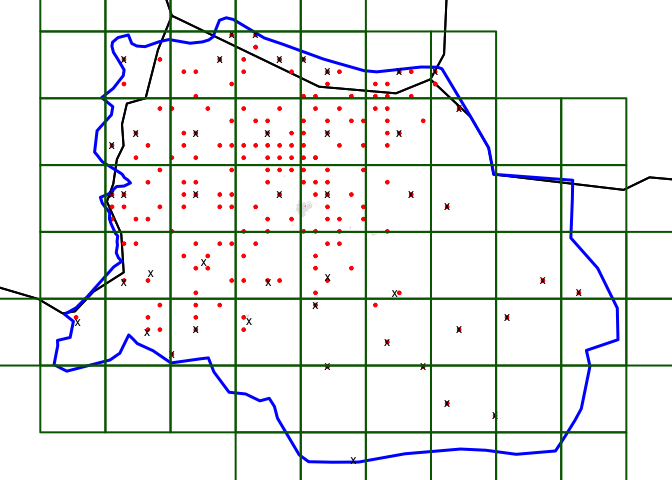

<!-- README.md is generated from README.Rmd. Please edit that file -->

# Applying CSAS for a surveillance project in Massakory, Hadjer Lamis, Chad

<!-- badges: start -->
<!-- badges: end -->

Following is an example of how a CSAS sample would look like when
applied to a study area in Massakory, Hadjer Lamis, Chad.

## Map of proposed study area

 

## Spatial sample of villages using CSAS approach

